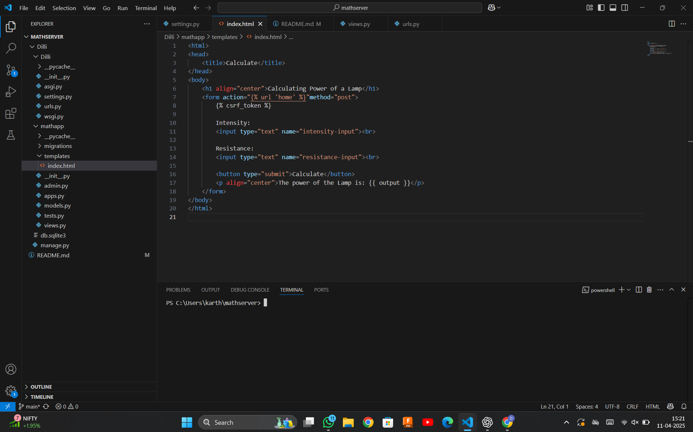
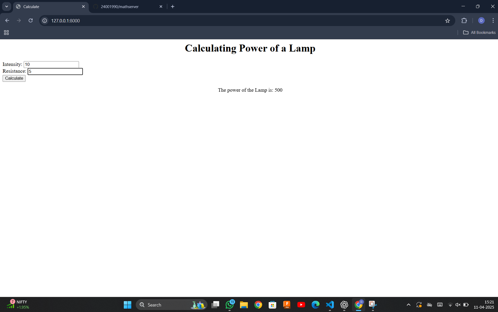

# Ex.05 Design a Website for Server Side Processing
# Date:11-4-25
# AIM:
To design a website to calculate the power of a lamp filament in an incandescent bulb in the server side.

# FORMULA:
P = I2R
P --> Power (in watts)
 I --> Intensity
 R --> Resistance

# DESIGN STEPS:
## Step 1:
Clone the repository from GitHub.

## Step 2:
Create Django Admin project.

## Step 3:
Create a New App under the Django Admin project.

## Step 4:
Create python programs for views and urls to perform server side processing.

## Step 5:
Create a HTML file to implement form based input and output.

## Step 6:
Publish the website in the given URL.

# PROGRAM :
```
<html>
<head>
    <title>Calculate</title>
</head>
<body>
    <h1 align="center">Calculating Power of a Lamp</h1>
    <form action=""method="post">
        

        Intensity:
        <input type="text" name="intensity-input"><br>

        Resistance:
        <input type="text" name="resistance-input"><br>

        <button type="submit">Calculate</button>
        <p align="center">The power of the Lamp is: {{ output }}</p>
    </form>
</body>
</html>
```
# SERVER SIDE PROCESSING:

# HOMEPAGE:

# RESULT:
The program for performing server side processing is completed successfully.
